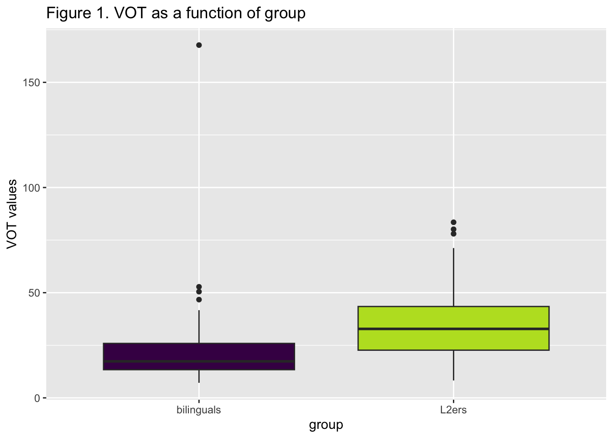
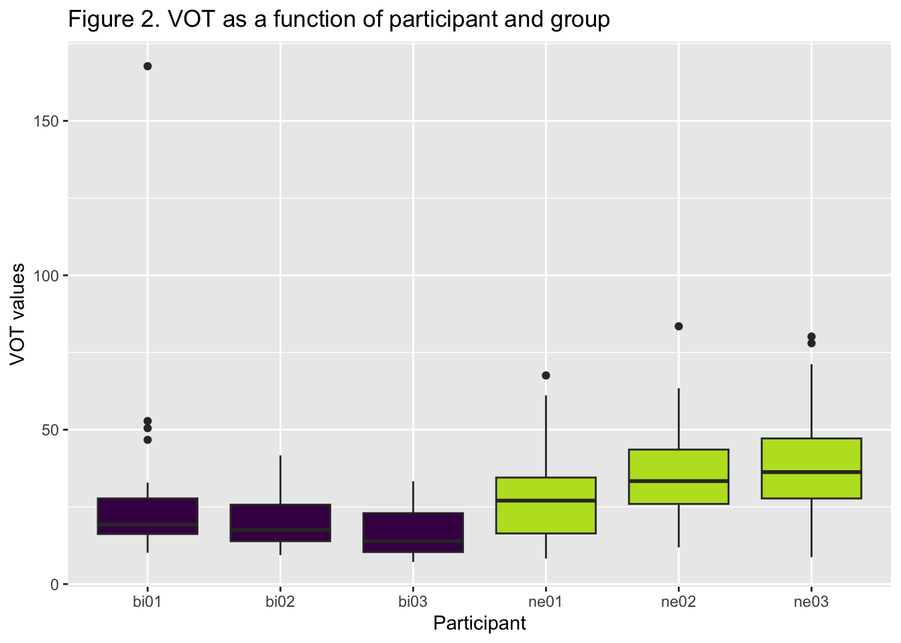
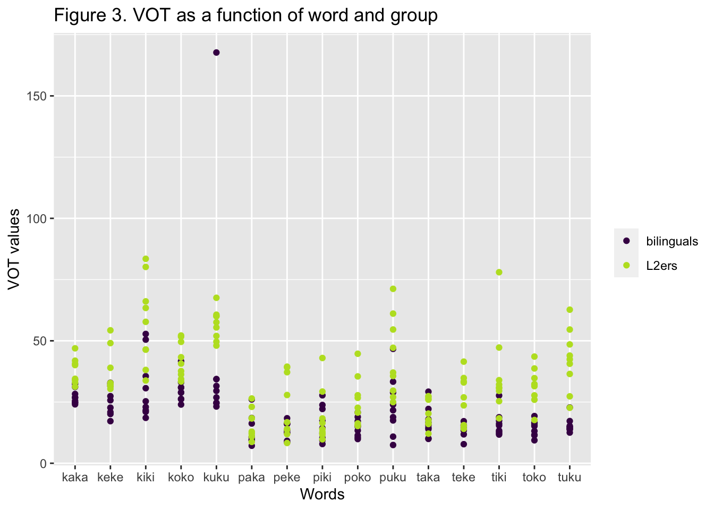
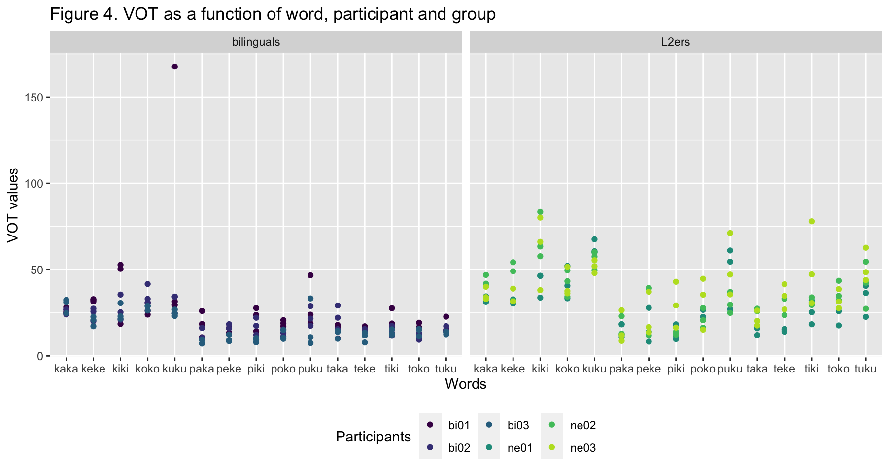
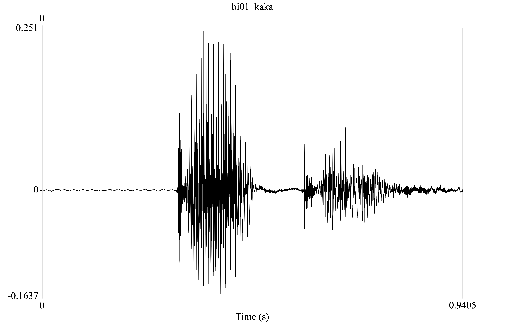
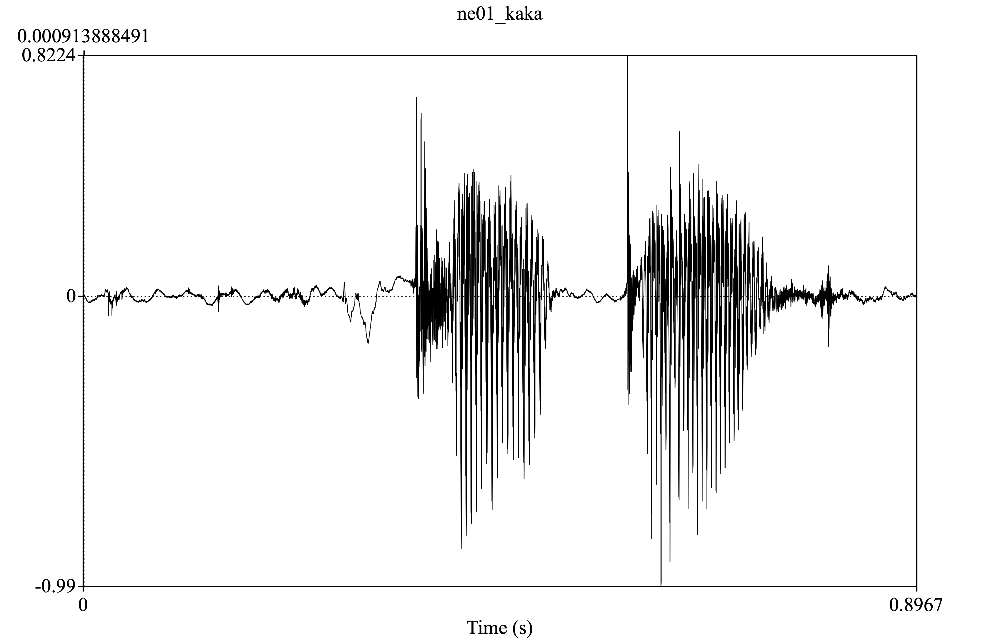

Programming assignment 4
================

**Author**: Meritxell Feliu Ribas  
**Date**: Last update: 2024-04-12 19:34:41

# Overview

<!-- 
  Talk briefly about what you did here 
  Describe your hypotheses
-->

## Assignment description

In this assignment, I learnt how to manage a “bigger” project with
production data. Since these data were not collected by me, I started
the assignment by taking a look at all README files in order to better
understand the project. After, I started working on the Praat part: I
normalized the scale peak intensity by using script 0 and created the
needed textgrids with script 1. In this script, I had to change the
participant ID (e.g., bi02, ne01, etc.) and replace the “Xs” with 45,
which is the number of wav files for each participant. I then manually
segmented each wav file and ran script 2 to extract the values (f1, f2,
vot) and get the data. In order to make script 2 work, I had to add the
participant ID and delete a \#, because it affected that line code. The
\# sign is used to add comments, so Praat could not run that line, which
was necessary for the loop to work. Afterwards, I tidied the data, got
some descriptive stats, and created some plots in R Studio.

## Hypothesis

The data come from 3 Spanish-English bilinguals and 3 English speaking
learners of Spanish. Considering that Spanish and English are different
in terms of VOT (VOT values for /p,t,k/ in Spanish are shorter
\[‘short-lag’\] compared to those of English \[‘long-lag’\]), I expect
L2 learners to have longer VOT values than the Spanish-English
bilinguals due to the influence of English, their L1.

# Prep

## Libraries

``` r
# Load libraries here

library("here")
library("readr")
library("tidyverse")
library("dplyr")
```

## Load data

``` r
# You need to get all the files in the 'data' directory and combine them
# Check previous examples we did in class 

data <- list.files(path = here("data"),
           pattern = ".csv",
           full.names = TRUE) %>%
  read_csv()
```

    ## Rows: 270 Columns: 5
    ## ── Column specification ────────────────────────────────────────────────────────
    ## Delimiter: ","
    ## chr (1): fileID
    ## dbl (3): f1, f2, vot
    ## lgl (1): notes
    ## 
    ## ℹ Use `spec()` to retrieve the full column specification for this data.
    ## ℹ Specify the column types or set `show_col_types = FALSE` to quiet this message.

``` r
summary(data)
```

    ##     fileID                f1               f2              vot        
    ##  Length:270         Min.   : 231.7   Min.   : 739.1   Min.   :  7.16  
    ##  Class :character   1st Qu.: 437.3   1st Qu.:1074.9   1st Qu.: 15.35  
    ##  Mode  :character   Median : 521.7   Median :1649.9   Median : 24.89  
    ##                     Mean   : 570.3   Mean   :1731.2   Mean   : 27.63  
    ##                     3rd Qu.: 650.8   3rd Qu.:2387.5   3rd Qu.: 34.08  
    ##                     Max.   :1882.1   Max.   :3011.6   Max.   :167.71  
    ##   notes        
    ##  Mode:logical  
    ##  NA's:270      
    ##                
    ##                
    ##                
    ## 

``` r
glimpse(data)
```

    ## Rows: 270
    ## Columns: 5
    ## $ fileID <chr> "bi01_kaka", "bi01_kaka1", "bi01_kaka2", "bi01_keke", "bi01_kek…
    ## $ f1     <dbl> 650.90, 714.32, 709.19, 495.24, 893.01, 579.31, 823.90, 348.26,…
    ## $ f2     <dbl> 1637.02, 1567.58, 1560.03, 2168.42, 2152.98, 2339.40, 2711.97, …
    ## $ vot    <dbl> 24.81, 25.49, 28.29, 31.55, 32.39, 32.87, 18.54, 52.80, 50.48, …
    ## $ notes  <lgl> NA, NA, NA, NA, NA, NA, NA, NA, NA, NA, NA, NA, NA, NA, NA, NA,…

## Tidy data

``` r
# Convert from long to wide or wide to long format as necessary (check 
# examples from class)
# Create any other relevant variables here 

data_final <- data %>%
  separate(
    col = fileID,
    into = c("participant", "word"),
    sep = "_") %>%
  mutate(
    group = case_when(
      startsWith(participant, "bi") ~ "bilinguals",
      startsWith(participant, "ne") ~ "L2ers")) %>%
  relocate(
    "group", .before = "participant") %>%
 separate(
    col = word,
    into = c("word", "trial"),
    sep = 4) %>%
  mutate(
    trial = ifelse(trial == "", 0, trial)) %>%
select(!(notes))
```

# Analysis

## Descriptives

``` r
# Give some descriptive summaries of your data 
# Display your descriptives in a table (try knitr::kable())

# Overall f1, f2, and vot mean values and sd for each group
data_final %>%
  group_by(group) %>%
  summarize(
    f1_mean = mean(f1), 
    f1_sd = sd(f1),
    f2_mean = mean(f2),
    f2_sd = sd(f2),
    vot_mean = mean(vot),
    vot_sd = sd(vot)) %>%
  mutate(
    group = case_when(
      group == "bilinguals" ~ "Bilinguals", 
      group == "L2ers" ~ "L2 learners")) %>%
  knitr::kable(
    col.names = c("Group", "F1 mean", "F1 sd", "F2 mean", "F2 sd", "VOT mean", "VOT sd"), 
    caption = "Table 1. Overall mean values and standard deviations for all acoustic measures by group")
```

| Group       |  F1 mean |    F1 sd |  F2 mean |    F2 sd | VOT mean |   VOT sd |
|:------------|---------:|---------:|---------:|---------:|---------:|---------:|
| L2 learners | 583.6756 | 201.0161 | 1782.225 | 657.6864 | 34.25052 | 16.24673 |
| Bilinguals  | 556.9053 | 204.7031 | 1680.179 | 678.5079 | 21.01593 | 15.47778 |

Table 1. Overall mean values and standard deviations for all acoustic
measures by group

``` r
# Overall f1, f2, and vot mean values and sd for each participant
data_final %>%
  group_by(group, participant) %>%
  summarize(
    f1_mean = mean(f1), 
    f1_sd = sd(f1),
    f2_mean = mean(f2),
    f2_sd = sd(f2),
    vot_mean = mean(vot),
    vot_sd = sd(vot)) %>%
  mutate(
    group = case_when(
      group == "bilinguals" ~ "Bilinguals", 
      group == "L2ers" ~ "L2 learners")) %>%
  knitr::kable(
    col.names = c("Group", "Participant", "F1 mean", "F1 sd", "F2 mean", "F2 sd", "VOT mean", "VOT sd"), 
    caption = "Table 2. Overall mean values and standard deviations for all acoustic measures by participant")
```

    ## `summarise()` has grouped output by 'group'. You can override using the
    ## `.groups` argument.

| Group       | Participant |  F1 mean |    F1 sd |  F2 mean |    F2 sd | VOT mean |    VOT sd |
|:------------|:------------|---------:|---------:|---------:|---------:|---------:|----------:|
| L2 learners | ne01        | 615.0404 | 239.1359 | 1870.316 | 726.4593 | 29.37489 | 15.439839 |
| L2 learners | ne02        | 573.2771 | 210.6586 | 1855.020 | 641.1433 | 35.51200 | 15.788772 |
| L2 learners | ne03        | 562.7091 | 141.1731 | 1621.340 | 581.9618 | 37.86467 | 16.640135 |
| Bilinguals  | bi01        | 520.2511 | 138.3988 | 1727.237 | 666.6207 | 26.19733 | 23.572779 |
| Bilinguals  | bi02        | 523.6933 | 133.5082 | 1584.488 | 666.2565 | 20.22156 |  8.050700 |
| Bilinguals  | bi03        | 626.7713 | 288.3431 | 1728.812 | 706.9056 | 16.62889 |  7.829326 |

Table 2. Overall mean values and standard deviations for all acoustic
measures by participant

``` r
# Overall vot mean values and sd for each group
data_final %>%
  group_by(group) %>%
  summarize(
    vot_mean = mean(vot),
    vot_sd = sd(vot)) %>%
  mutate(
    group = case_when(
      group == "bilinguals" ~ "Bilinguals", 
      group == "L2ers" ~ "L2 learners")) %>%
  knitr::kable(
    col.names = c("Group", "VOT mean", "VOT sd"), 
    caption = "Table 3. Overall mean values and standard deviations for VOT by group")
```

| Group       | VOT mean |   VOT sd |
|:------------|---------:|---------:|
| L2 learners | 34.25052 | 16.24673 |
| Bilinguals  | 21.01593 | 15.47778 |

Table 3. Overall mean values and standard deviations for VOT by group

``` r
# Overall vot mean values and sd for each participant
data_final %>%
  group_by(group, participant) %>%
  summarize(
    vot_mean = mean(vot),
    vot_sd = sd(vot)) %>%
  mutate(
    group = case_when(
      group == "bilinguals" ~ "Bilinguals", 
      group == "L2ers" ~ "L2 learners")) %>%
  knitr::kable(
    col.names = c("Group", "Participant", "VOT mean", "VOT sd"), 
    caption = "Table 4. Overall mean values and standard deviations for VOT by participant")
```

    ## `summarise()` has grouped output by 'group'. You can override using the
    ## `.groups` argument.

| Group       | Participant | VOT mean |    VOT sd |
|:------------|:------------|---------:|----------:|
| L2 learners | ne01        | 29.37489 | 15.439839 |
| L2 learners | ne02        | 35.51200 | 15.788772 |
| L2 learners | ne03        | 37.86467 | 16.640135 |
| Bilinguals  | bi01        | 26.19733 | 23.572779 |
| Bilinguals  | bi02        | 20.22156 |  8.050700 |
| Bilinguals  | bi03        | 16.62889 |  7.829326 |

Table 4. Overall mean values and standard deviations for VOT by
participant

## Visualization

### Plots of the VOT values

``` r
# Include some plots here

data_final %>%
  ggplot() +
  aes(x = group, y = vot, fill = group) +
  # facet_wrap(. ~ group) +
  geom_boxplot(show.legend = FALSE) +
  scale_fill_viridis_d(name = NULL, end = 0.9) +
  labs(y = "VOT values", y = "Group", title = "Figure 1. VOT as a function of group")
```



``` r
data_final %>%
  ggplot() +
  aes(x = participant, y = vot, fill = group) +
  geom_boxplot(show.legend = FALSE) +
  scale_fill_viridis_d(name = NULL, end = 0.9) +
  labs(x = "Participant", y = "VOT values", title = "Figure 2. VOT as a function of participant and group")
```



``` r
data_final %>%
  ggplot() +
  aes(x = word, y = vot, color = group) +
  geom_point() +
  scale_color_viridis_d(name = NULL, end = 0.9) +
  labs(x = "Words", y = "VOT values", title = "Figure 3. VOT as a function of word and group")
```



``` r
# Include some plots here

data_final %>%
  ggplot() +
  aes(x = word, y = vot, color = participant) +
  facet_wrap(. ~ group) +
  geom_point() +
  scale_color_viridis_d(name = "Participants", end = 0.9) +
  theme(legend.position = "bottom",
  legend.background = element_blank()) +
  labs(x = "Words", y = "VOT values", title = "Figure 4. VOT as a function of word, participant and group") 
```



### Examples of the production data

Figure 5. Waveform of the word *kaka* produced by a participant from the
bilingual group. 
</br></br>

Figure 6. Waveform of the word *kaka* produced by a participant from the
L2 learners group. 

<!-- 
Also include a professional looking figure illustrating an example of the acoustics 
of the production data, i.e., a plot generated in praat.
You decide what is relevant (something related to your hypothesis). 
Think about where this file should be located in your project. 
What location makes most sense in terms of organization? 
How will you access the file (path) from this .Rmd file?
If you need help consider the following sources: 
  - Search 'Rmarkdown image' on google, stackoverflow, etc.
  - Search the 'knitr' package help files in RStudio
  - Search the internet for HTML code (not recommended, but it works)
  - Check the code from my class presentations (may or may not be helpful)
-->

## Hypothesis test

``` r
# Conduct a simple statistical analysis here (optional)
```

# Conclusion

<!-- 
Revisit your hypotheses (refer to plots, figures, tables, statistical tests, 
etc.)
&#10;Reflect on the entire process. 
What did you enjoy? What did you hate? What did you learn? 
What would you do differently?
-->

I predicted that English L2 learners of Spanish would have longer VOT
values due to the influence from their L1, compared to Spanish-English
bilinguals. Although no models were created and, thus, it cannot be
assured that there is a significant difference between groups and that
English and/or Spanish age of acquisition were significant predictors (I
do not have these kind of data), the calculated means and the plots
indicate that the VOT values of the participants in the L2 learners
group were longer (mean = 34.25) than those in the bilingual group (mean
= 21.01). Furthermore, Figures 1 and 2 suggest that there is more
variability within the L2 learners group. Further analysis is needed to
confirm these observations.

**Some reflections:** This last programming assignment was quite long.
Although I would not say that it was very difficult, the Praat part was,
indeed, tedious. I tried to use the function praatpicture() to include a
couple of images from the wav files. However, it did not work (even
though I tried for a while). Thanks to that, I learnt how to create and
export pictures from Praat!

</br></br>
